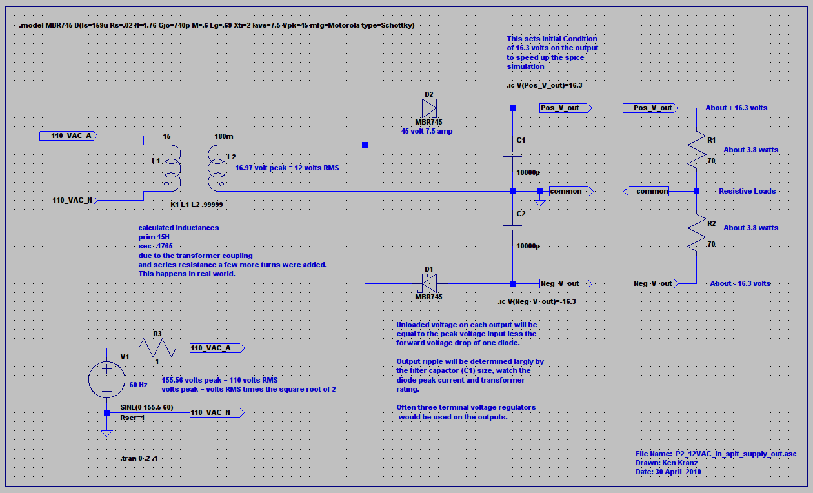
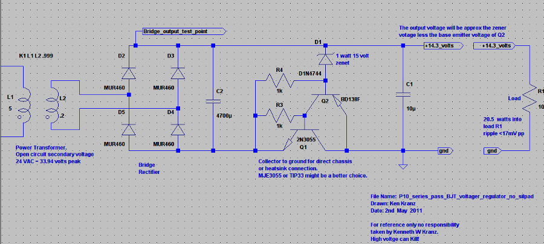

# LTSpice: Ken's Schematics

Author: Ken Kranz (ken.w.kranz@gmail.com)

## Power Supply

2011:

This page has power supply related projects, P1 was the first listed, P11b the last.

New additions will be made from time to time. 

### P1 Simple bridge rectifier and capacitor power supply

This working spice model includes a 3 amp diode model and uses the Initial Condition directive to speed up the simulation.

The image below shows the transformer secondary current at turn on as the output voltage (white trace) moves to its final voltage.

It started at 22.5 volts because of the initial condition directive.

[P1 LTSpice file](P1_Bridge_rectifier_and_capacitor.asc)

This is the LTSpice file remember to change the font size.

### P2 Simple split supply suitable for opamps with a 12 volt AC input

Do you need a split supply of running from a small AC plug pack or wall wart?

This may be your solution, often small three terminal regulators would be fitted on the outputs.

Today I actually made made a 20dB gain three channel ic amp using three LM318's, it is powered by a 12 VAC plug pack and a circuit very similar to this.

No voltage regulators were used, no hum is visible in the output, noise only.

[P2 LTSpice file](P2_12VAC_in_split_supply_out.asc)

### P3 100mA split power supply from a single DC supply

A simple low component count method of generating a split supply (pos, neg and gnd) from a single floating supply.

Suitable for  opamp supply, three terminal voltage regulators could be employed on the outputs.

[P3 LTSpice file](P3_simple100mAsplitrailfromsinglerail.asc)

### P4    Classic Cockcroft Walton Voltage multiplier.

This simulation has a 24 VAC input and the unloaded output is > 500 volts.

Each stage has a test point so the operation may be probed as in the image below.

All the capacitor values can be changed at once by editing the  .param cap=10u, it is set at 10uF, try different values and try loads on various output taps.

[P4 LTSpice file](P4_Cockcroft_Walton.asc)

### P5  Lower Z Voltage multiplier.

This topology has some advantages over the simpler design (see P4).

Some of the values are a little unrealistic and no ESR entries have been made for the capacitors, indeed the cost of parts make this topology as drawn impractical.

The P5 circuit has an input of 24 VAC and an output of  200 watts at 450 VDC.

Using this type of topology it is possible to supply B+ to smaller projects using voltage multipliers.

[P5 LTSpice file](P5_Lower_z_voltage_multiplier.asc)

### P5b  Lower Z Voltage multiplier (more practical).

Below (P5b) is something a little more practical that could be built.

Spice transformer values and capacitor values are realistic.

[P5b LTSpice file](P5b_Lower_z_voltage_multiplier.asc)

### P6 Ultra simple shunt regulator or high powered zener diode from cheap parts.

Often a shunt regulator is a practical method of supplying a regulated voltage.

Some reasons to use a shunt regulator include.
  - A low voltage drop across the regulator.
  - A very constant load current and supply voltage can enable reasonable efficiency
  - Simplicity
  - Can offer good transient over voltage protection.
  - Can be set up to conduct only when over-voltage occurs.

[P6 LTSpice file](P6_Ultra_simple_Shunt_regulator_zener_replacement.asc)

Obviously this needs to be modified to suit your application.

D1 and Q2 make up a sudo large zener diode.

Large NPN transistors tend to be a little hardier than the PNP types.

The advantage of the circuit as drawn is, if the chassis is negative ground the metal body of the transistor can be attached directly to ground.

Almost forgot.

Remember to add the base emitter voltage to the output voltage, this is normally a little over 0.6 of a volt.

Using a 15 volt zener will give an output of about 15.6 volts.

This circuit will be softer than a more complex regulator, it is however most useful.

Q1 and D1 can be mounted on the chassis/heatsink as a two terminal device (zener replacement) for many applications.

Don't forged to have look at the SOA graph on the transistor data sheet and to derate for temp rise.

### P8 SCR Bucket Regulator

This type of regulator normally has a lot of output ripple and can be hard on power transformers.

I remember using one in the 1970's; it actually worked well for the particular application reducing the heat from the previously used linear regulator.

After searching the web for working examples and finding nothing this is the result, my version.

This topology is presented as is.

Given the correct conditions it may be the best solution.

I remember this type of regulator was used as a pre-regulator for a linear power supply to reduce the overall dissipation.

BTW: the MUR460 diodes are working a bit hard in the simulation and should be a bit heavier.

Remember it is easy to find out the dissipation of any part while running the  LTSpice simulation.

[P8 LTSpive file](P8_scr_bucket_regulator.asc)

### P9 A simple single transistor series pass linear voltage regulator.

This very simple circuit still has its applications, the current through Q1 is limited by its hFE and the value of R2 to a max of about 2.7 amps preventing damage at turn on.

Placing a capacitor across the zener D1 can produce some electronic filtering, extra problems arise necessitating more components.

A simple FET equivalent of this circuit is not as good, some extra components are required.

[P9 LTSpice file](P9_Series_pass_single_transistor_regulator.asc)

### P 10 A simple series pass voltage regulator with the main pass transistor collector at ground potential.

This very simple circuit still has no current limiting and must have fuse protection.

Regulation is quite adequate for many applications.

The big feature is if the chassis of the device is negative ground the main series pass transistor will bolt directly to ground with no mica or silpad required, this can have enormous thermal advantages.

You do the sums, a TO-220 package insulating system may be 1 degree C per watt!

If dissipating 20 watt you have lost 20 degrees C across the insulator.

[P10 LTSpice file](P10_series_pass_BJT_voltage_regulator_no_silpad.asc)

### P11a    Buck switching regulator (schottky diode) demonstration schematic and spice.

The spice simulation demonstrates the relationship between the input voltage, the drive duty cycle and the output voltage.

Try changing the supply voltage and the load resistance to find out the main advantages and disadvantages when compared to the topology in P11b below.

[P11a LTSpice file](P11a_buck_converter.asc)

Ooops I forgot to include the spice models, they should be in the default LTSpice library, if not here they are.

.model IRFP9240 VDMOS(pchan Rg=3 Vto=-4 Rd=200m Rs=50m Rb=100m Kp=8.2 Lambda=.10 Cgdmax=1.8n Cgdmin=.07n Cgs=.77n Cjo=.77n Is=76p mfg=International_Rectifier Vds=-200 Ron=500m Qg=44n)

.model PDS760 D(Is=360n Rs=.016 N=1.04 Cjo=1200p M=.33 Eg=.69 Xti=2 Iave=7 Vpk=60 mfg=Diodes_Inc. type=Schottky)

### P11b   Buck switching regulator ( synchronous rectifier) demonstration schematic and spice.

This schematic is the result of something that is needed in my workshop.

The spice simulation demonstrates the relationship between the input voltage, the drive duty cycle and the output voltage.

My requirement is for a couple 1000 watt bench top power supplies that can supply large current pulses, obviously more FET's will be used than in this simulation, quite a large output capacitor will be used.

My thoughts at the moment steer me towards a DC restored transformer drive for the high side FET's and a PIC micro controller to produce the PWM.

I want to try something a little different using the PIC ADC to monitor the ripple voltage from the transformer rectifier capacitor input and to calculate the PWM for the required output voltage on the fly.

The output voltage and current will also be available to the PIC adjusting  variables in the PWM generator within preset limits.

This project is on my to do list that seems to grow every day.

[P11b LTSpice file](P11b_buck_converter_.asc)

